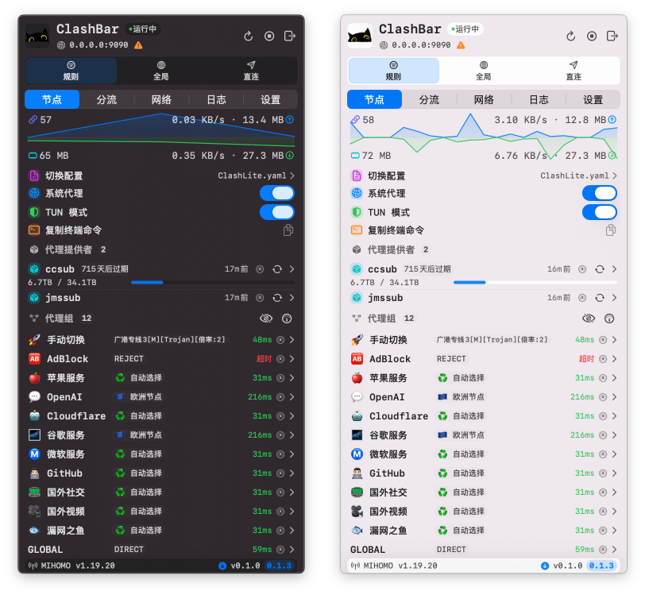
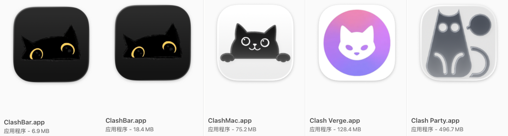

<div align="center">


# ClashBar

原生 macOS 菜单栏代理客户端（SwiftUI + AppKit），以 `mihomo` 为 Core。

<p>
  
  
  
  
  <a href="https://github.com/Sitoi/ClashBar/releases" target="_blank" rel="noopener noreferrer">
    
  </a>
  <a href="https://github.com/Sitoi/ClashBar/stargazers" target="_blank" rel="noopener noreferrer">
    
  </a>
  <a href="https://github.com/Sitoi/ClashBar/issues" target="_blank" rel="noopener noreferrer">
    
  </a>
  <a href="https://t.me/clashbars" target="_blank" rel="noopener noreferrer">
    
  </a>
</p>

<p>
  <strong>加入 Telegram 群获取更新与支持：</strong>
  <a href="https://t.me/clashbars" target="_blank" rel="noopener noreferrer">@clashbars</a>
</p>

</div>



---

## 👋 项目简介

ClashBar 是一款面向 macOS 的原生菜单栏代理客户端，基于 `mihomo` Core，聚焦于「轻量入口、稳定运行、可观测运维」。  
在不打开复杂主窗口的前提下，你可以在菜单栏中完成配置管理、节点切换、规则刷新、连接排障与系统代理控制。 ✨

## 🤖 项目说明

ClashBar 是一个「纯 AI vibe coding」驱动的自用项目。  
项目在需求整理、实现迭代、文档维护等环节持续与 Codex 协作，以更快验证想法并沉淀可复用实践。 🚀

## 🎯 项目初心

ClashBar 的设计目标始终围绕两个关键词：**轻量** 与 **稳定**。

- 🪶 轻量化优先：在打包 `mihomo` Core 的前提下，应用体积目标控制在 **40 MB 以内**。
- 📦 可裁剪交付：移除 Core 后，应用体积目标控制在 **10 MB 以内**，便于快速分发与集成。
- 🛡️ 稳定性优先：优先保证日常可用性与长期运行稳定，避免为短期功能堆叠牺牲可靠性。

## 📏 App 体积对比（macOS）



| 客户端          | 应用体积 | 相对 ClashBar |
| --------------- | -------: | ------------: |
| ClashBar.app    |  37.5 MB |          1.0x |
| ClashMac.app    |  75.2 MB |          2.0x |
| Clash Verge.app | 128.4 MB |          3.4x |
| Clash Party.app | 496.7 MB |         13.2x |

> [!NOTE]
> 对比数据来自同一台 macOS 环境下 Finder 显示值（截图基准）。不同版本与构建方式会影响最终体积，以上用于说明轻量化设计方向。

## ✨ 核心能力

| 领域             | 能力说明                                   | 业务价值                         |
| ---------------- | ------------------------------------------ | -------------------------------- |
| 🟢 Core 生命周期 | `Start` / `Stop` / `Restart`               | 快速恢复网络可用性，降低中断时间 |
| 🧩 配置管理      | 本地导入、远程导入、批量更新、重载配置     | 多订阅场景下保持配置一致性       |
| 🚦 流量策略      | `Rule` / `Global` / `Direct` 模式切换      | 针对不同网络场景快速切换策略     |
| 🌍 节点运维      | Proxy Group 切换、延迟测试、Provider 更新  | 提升线路质量与稳定性             |
| 📊 可观测性      | 实时速率、连接数、内存、活动连接、日志过滤 | 快速定位“慢、断、不通”等问题     |
| 🔐 系统集成      | 系统代理开关、开机启动、权限协同           | 与 macOS 深度协作，降低操作成本  |
| 🌐 国际化        | 简体中文 / English                         | 支持团队协作与跨语言使用         |

## 🚀 快速上手（用户）

1. 点击菜单栏图标打开 ClashBar 面板。 🖱️
2. 在 `Proxy` 页面选择配置，或导入本地/远程配置。 📥
3. 点击 `Start` 启动 Core，必要时执行 `Restart`。 ▶️
4. 选择代理模式：`Rule` / `Global` / `Direct`。 🎛️
5. 在 Proxy Group 中切换节点并执行延迟测试。 📶
6. 验证可用后开启系统代理。 ✅

## 🗺️ 功能导航

- 🧭 `Proxy`：实时速率、连接数、内存、配置入口、系统代理开关
- 📚 `Rules`：规则统计、规则刷新、Provider 更新
- 🌐 `Activity`：连接过滤、关闭单连接、关闭全部连接
- 🪵 `Logs`：日志级别过滤、关键词检索、日志复制
- ⚙️ `System`：语言、状态栏样式、`allow-lan` / `ipv6` / `log-level`、端口设置

## 🎯 典型场景

- 🏠 日常办公：根据网络环境快速切换配置与节点，保障在线稳定性。
- 🧪 故障排查：结合 `Activity + Logs` 分析连接异常与规则命中问题。
- 🔁 订阅维护：批量更新远程配置后，一键重载并复核节点延迟。
- 🛡️ 安全优先：敏感信息写入 Keychain，日志内容自动脱敏。

## 📁 数据目录

运行时根目录：

- `~/Library/Application Support/clashbar`

目录结构与职责：

| 路径      | 作用                                               | 管理建议                         |
| --------- | -------------------------------------------------- | -------------------------------- |
| `config/` | 存放用户配置文件（`.yaml` / `.yml`）与订阅导入结果 | 建议纳入备份；可手动维护文件命名 |
| `logs/`   | 运行日志与排障信息输出目录                         | 排障完成后可按需清理             |
| `state/`  | 应用运行状态与会话相关数据                         | 建议由程序维护，不建议手动编辑   |
| `core/`   | 运行时 Core 二进制（如 `mihomo`）                  | 升级/替换前先停止 Core           |

配置发现规则：

- 仅识别 `.yaml` / `.yml` 文件
- 按文件名排序加载
- 未手动指定时，默认选中首个配置

> [!TIP]
> 建议只对 `config/` 做日常维护，其余目录优先交由 ClashBar 管理，以降低运行状态不一致风险。

## 🔄 内核目录与切换

运行时内核路径：

- `~/Library/Application Support/clashbar/core/mihomo`

首次启动会将应用内置内核复制到上述目录。后续运行统一使用该路径，避免改写已签名的 app bundle。

切换内核步骤：

1. 在 ClashBar 中执行 `Stop`，确保当前内核进程已停止。
2. 准备目标内核可执行文件（如 `mihomo`，命名需要保存一致）。
3. 返回 ClashBar，执行 `Start` 或 `Restart`。

异常处理：

- 若切换后出现缓存兼容问题，可清理缓存后重试：

```bash
rm -f "$HOME/Library/Application Support/clashbar/cache.db"
```

- 使用 TUN 模式时，切换内核后可能需要重新授权相关权限（root + setuid）。

## ❓ 常见问题

### 1) macOS 提示“已损坏”或“无法验证开发者” 🔒

**现象**：应用首次启动被系统拦截。  
**原因**：macOS Gatekeeper 对未公证应用的默认安全策略。

**处理步骤**

1. 将应用放置到 `/Applications/ClashBar.app`。
2. 打开 **系统设置 → 隐私与安全性**，点击「仍要打开（Open Anyway）」。
3. 若仍被拦截，可移除隔离标记后重试：

```bash
sudo xattr -r -d com.apple.quarantine /Applications/ClashBar.app
```

### 2) 系统代理开启失败 ⚙️

**现象**：点击系统代理开关后未生效或立即回退。  
**原因**：通常与权限授权、Helper 状态或应用安装位置有关。

**处理步骤**

1. 确认使用的是打包后的应用，并位于 `/Applications`。
2. 在 macOS 系统设置中完成 ClashBar 相关权限批准。
3. 回到应用执行一次 `Restart` Core 后再次开启系统代理。
4. 如仍失败，打开 `Logs` 检查关键错误并提交 Issue。

### 3) 切换节点后网络无变化 🌐

**现象**：已切换 Proxy Group 或节点，但访问效果未变化。  
**原因**：常见于模式不匹配、节点未生效或配置未重载。

**处理步骤**

1. 执行一次延迟测试，确认目标节点可用。
2. 确认当前模式为 `Rule` 或 `Global`（避免误处于 `Direct`）。
3. 重新选择目标 Proxy Group/节点，并执行 `Restart` Core。

### 4) 远程配置更新后未生效 🔁

**现象**：远程更新成功，但节点或规则未刷新。  
**原因**：配置列表未重载或当前生效配置未切换到最新版本。

**处理步骤**

1. 先执行远程更新，再点击 `重载配置`。
2. 重新选择目标配置，确认当前生效项已切换。
3. 如仍异常，检查 `Logs` 中是否存在拉取失败或解析错误。

### 5) 请求没有按预期走代理 🧭

**现象**：部分域名/IP 走向与预期策略不一致。  
**原因**：通常是规则命中顺序、分流策略或配置内容导致。

**处理步骤**

1. 在 `Rules` 页面检查命中规则与策略结果。
2. 在 `Activity` 定位对应连接，核对目标地址与链路。
3. 在 `Logs` 通过关键词过滤交叉验证最终路由决策。

## 🙌 反馈与支持

- Telegram 社区：<https://t.me/clashbars>
- Issue / PR：欢迎提交功能建议、稳定性问题与文档修正。 💬

## 👥 贡献者

感谢所有参与贡献的开发者：

[](https://github.com/Sitoi/ClashBar/graphs/contributors)

## 🙏 致谢

- 感谢 [OpenAI Codex](https://openai.com/codex/) 在需求拆解、工程实现与文档优化中的持续协作。 🤝
- 感谢 [MetaCubeX/mihomo](https://github.com/MetaCubeX/mihomo) 提供稳定可靠的 Core 能力。

## ✨ Star 数

[](https://www.star-history.com/#Sitoi/ClashBar&type=date&legend=top-left)

## 📄 许可证

本项目采用 `GPL-3.0 license`，详见 [LICENSE](LICENSE)。
